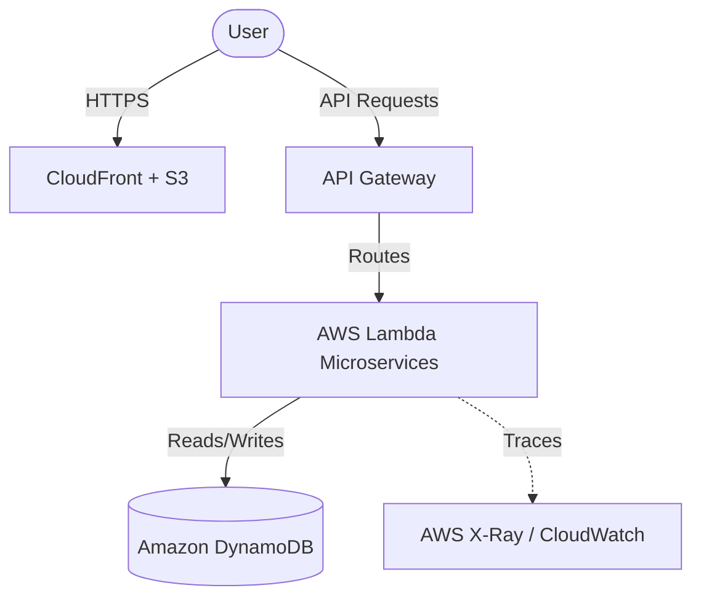
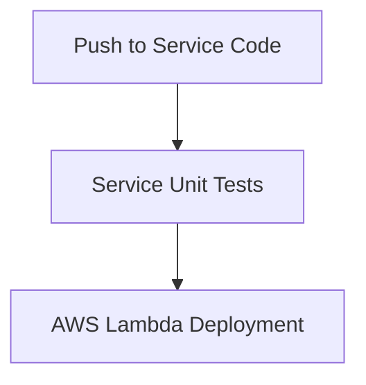
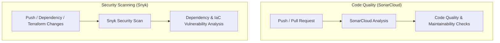

# 🛍️ Serverless E-Commerce Platform

A production-grade, 100% serverless full-stack e-commerce solution designed for high scalability, cost efficiency, and zero-trust security. It features a modern React Single Page Application (SPA) client and a decoupled, single-responsibility microservices backend orchestrated by AWS Lambda, API Gateway, and Amazon DynamoDB, fully provisioned via Terraform IaC.

🚀 **Live Deployment:** [https://d30dvwr72k2y05.cloudfront.net/](https://d30dvwr72k2y05.cloudfront.net/)

---

## ⚡ Project Highlights

* **100% Serverless Architecture**: Built entirely on pay-per-use AWS services (Lambda, API Gateway, DynamoDB, S3, CloudFront).
* **Decoupled Microservices**: 6 independent microservices communicating via secure HTTP APIs and event-driven SNS messages.
* **Infrastructure as Code (IaC)**: Entire AWS cloud environment managed and deployed via modular, DRY Terraform scripts.
* **DevSecOps Integration**: Automated testing and deployment pipelines configured with GitHub Actions, SonarCloud analysis, and Snyk vulnerability scanning.
* **Full Observability**: Integrated AWS Distro for OpenTelemetry (ADOT), AWS X-Ray distributed tracing, and CloudWatch metrics dashboard with SNS alerting.

---

## ✨ Features

### 🛒 Customer Features
* **Product Catalog**: Dynamic list with filtering by category and instant search.
* **Wishlist**: Secure, personalized bookmarks for saving favorite products.
* **Shopping Cart**: Real-time management, adding, updating, and removing cart items.
* **Checkout Flow**: Complete express ordering sequence with simulated card payment.

### 💼 Admin Features
* **Product Catalog CRUD**: Interface to add, update, list, and delete catalog items.
* **Inventory Control**: Real-time tracking and adjustment of product stock levels.
* **Order Management**: Monitor customer checkout records and update shipping status.
* **Business Analytics**: Key KPIs showing sales numbers, quantities sold, and order volumes.

---

## 🏗️ Architecture

A clean, highly available architecture routing global requests through CloudFront to serverless compute and database layers:



---

## 🛠️ Technology Stack

| Category | Technologies |
|---|---|
| **Frontend** | React, Vite, React Router v6, Context API, Vanilla CSS, Jest |
| **Backend** | Node.js, AWS Lambda, API Gateway, Joi Payload Validation |
| **Cloud Database** | Amazon DynamoDB (NoSQL) |
| **Infrastructure** | Terraform IaC |
| **DevSecOps** | GitHub Actions, SonarCloud Static Code Analysis, Snyk Vuln Scan |
| **Monitoring** | CloudWatch Dashboard, CloudWatch Alarms, SNS Alerts, AWS X-Ray, ADOT (OpenTelemetry) |

---

## 🧩 Microservices

| Service | Purpose | Database Table |
|---|---|---|
| **Product Service** | Manages catalog items, metadata, and search queries | `product-{owner}` |
| **Inventory Service**| Tracks and adjusts stock availability | `inventory-{owner}`|
| **Cart Service** | Manages temporary shopping carts per user | `cart-{owner}` |
| **Wishlist Service** | Tracks user product bookmarks | `wishlist` |
| **Payment Service** | Handles payment simulation and transaction tracking | `payment-{owner}` |
| **Order Service** | Orchestrates checkout, validates inventory, and processes orders | `order-{owner}` |

---

## 🚀 CI/CD Pipeline

Continuous integration and deployment are managed via independent workflows to keep checks and deployments isolated.

### Frontend Pipeline

Automated build and deployment flow for the React SPA:

```mermaid
graph TD
    A[Push to Frontend Code] --> B[Frontend Tests (Jest)]
    B --> C[Vite Build]
    C --> D[Amazon S3 Upload]
    D --> E[CloudFront Cache Invalidation]
    E --> F[Production Deployment]
```

### Backend Pipeline

Automated testing and isolated deployment per microservice:



### Code Quality & Security (DevSecOps)

Static analysis and security checking run independently of the deployment pipelines on integration events:




---

## 📊 Monitoring & Observability

The application implements full-stack observability to capture metrics, trace requests, and alert on incidents:
* **CloudWatch Dashboard**: Central dashboard tracking API Gateway error rates, Lambda execution latency, and DynamoDB capacities.
* **CloudWatch Alarms & SNS**: Triggers immediate alerts via Amazon SNS if error rates or throttling breach thresholds.
* **AWS X-Ray & OpenTelemetry**: Uses the AWS Distro for OpenTelemetry (ADOT) layer to trace client requests end-to-end across multiple Lambdas and databases, visualizing system dependencies and hot-spots.

---

## 🔒 Security & Code Quality

* **Static Analysis**: SonarCloud tests every code integration for quality gates, code smells, duplication, and coverage.
* **Vulnerability Gating**: Snyk scans dependencies automatically during pipeline builds to block insecure packages.
* **Payload Verification**: Joi validators enforce strict request-response schemas on API Gateway endpoints to prevent NoSQL injection.
* **Infrastructure Security**: Least-privilege IAM roles restrict access to DynamoDB tables and cross-service invocations.

---

## 📦 Project Structure

```text
ecommerce-v2/
├── .github/workflows/          # Automated CI/CD workflows
├── ecommerce-frontend/         # React + Vite client-side SPA
│   ├── src/
│   │   ├── components/         # Common layouts, route protection
│   │   ├── context/            # Cart & Wishlist state contexts
│   │   ├── pages/              # Customer & Admin pages
│   │   └── services/           # Backend API connection logic
│   └── package.json
└── ecommerce-microservices/    # Node.js services & IaC resources
    ├── cart-service/           # Shopping cart service
    ├── inventory-service/      # Inventory service
    ├── order-service/          # Order placement coordinator
    ├── payment-service/        # Simulated payment processor
    ├── product-service/        # Product catalog service
    ├── wishlist-service/       # Bookmark wishlist service
    └── terraform/              # Terraform scripts (DynamoDB, Lambda, dashboards)
```

---

## ☁️ Deployment

### 1. Provision Cloud Infrastructure (Terraform)
Since `terraform.tfvars` is pre-configured in the repository, you can deploy the database, computing, routing, and monitoring assets directly:

```bash
cd ecommerce-microservices/terraform
terraform init
terraform apply
```

### 2. Service Code Updates (CI/CD)
Subsequent code merges to the `main` branch trigger GitHub Actions to run verification tests and automatically update the corresponding S3 client bucket or AWS Lambda function packages.
