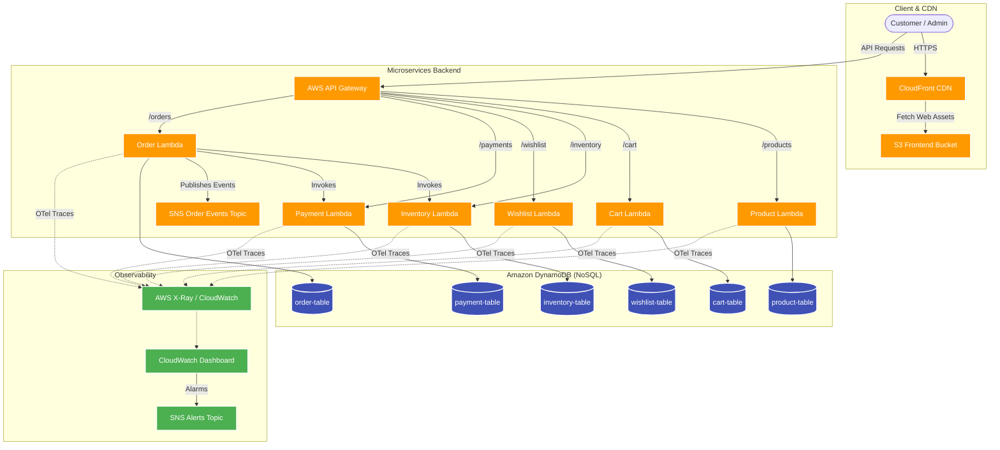

# 🛍️ Serverless E-Commerce Platform (v2)

A production-ready, serverless full-stack e-commerce application featuring a React frontend and modular AWS Lambda microservices backends.

🚀 **Live Deployment Link:** [https://d30dvwr72k2y05.cloudfront.net/](https://d30dvwr72k2y05.cloudfront.net/)

---

## 🏗️ System Architecture



---

## 🛠️ Technology Stack

* **Frontend**: React (Vite), React Router v6, Context API, Vanilla CSS, Jest.
* **Backend Microservices**: Node.js, AWS Lambda (HTTP API Gateway proxy), Amazon DynamoDB, Joi schema validation.
* **Infrastructure as Code**: Terraform (Dynamic DRY mappings, CloudWatch dashboards, SNS alerting).
* **Observability**: AWS Distro for OpenTelemetry (ADOT) layer for Lambda tracing & X-Ray service maps.
* **CI/CD**: GitHub Actions (17 workflows for automated tests and deployments), SonarCloud, and Snyk security scans.

---

## 📦 Project Structure

```text
ecommerce-v2/
├── .github/workflows/         # CI/CD pipelines (unit testing & Lambda/S3 deploys)
├── ecommerce-frontend/        # React client application code
└── ecommerce-microservices/   # Backend services & Infrastructure definitions
    ├── cart-service/          # Shopping cart logic
    ├── inventory-service/     # Stock management logic
    ├── order-service/         # Checkout & Order processing logic
    ├── payment-service/       # Simulated checkout payment gateway
    ├── product-service/       # Catalog & Item management logic
    ├── wishlist-service/      # Wishlist operations logic
    └── terraform/             # AWS resources IaC configurations
```

---

## 🧩 Microservices Catalog

| Service | Route Base | Table Name | Purpose |
|---|---|---|---|
| **Product** | `/products` | `product-{owner}` | Catalog lookup & inventory details |
| **Cart** | `/cart` | `cart-{owner}` | Shopping cart storage |
| **Inventory**| `/inventory`| `inventory-{owner}`| Product stock availability |
| **Wishlist** | `/wishlist` | `wishlist` | User's favorite products list |
| **Payment** | `/payments` | `payment-{owner}` | simulated checkouts & refunds |
| **Order** | `/orders` | `order-{owner}` | Checkout coordination & tracking |

---

## ⚡ Setup & Deployment

### Local Development

#### 💻 Frontend client
```bash
cd ecommerce-frontend
npm install
npm run dev   # Runs on http://localhost:5173
npm test      # Run frontend unit tests
```

#### ⚙️ Microservices (e.g. Product Service)
```bash
cd ecommerce-microservices/product-service
npm install
npm test      # Run service unit tests
```

### ☁️ AWS Cloud Deployment (Terraform)
```bash
cd ecommerce-microservices/terraform
cp terraform.tfvars.example terraform.tfvars # Set your custom resource_owner value
terraform init
terraform plan
terraform apply
```
